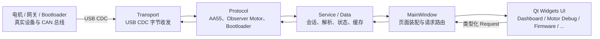
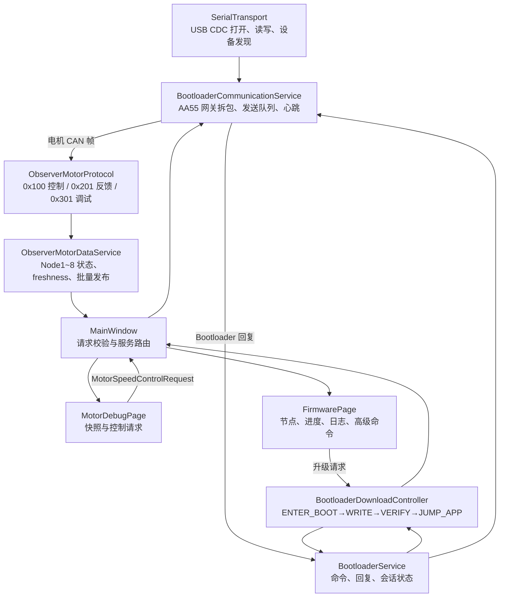
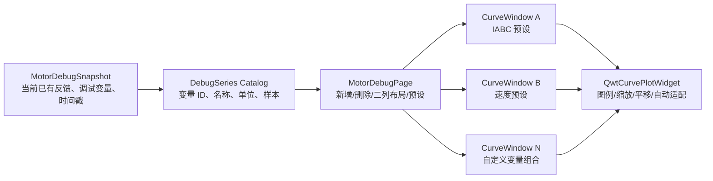
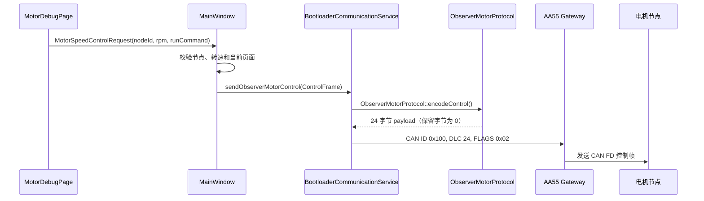
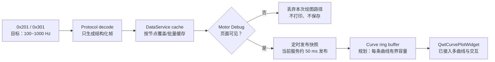
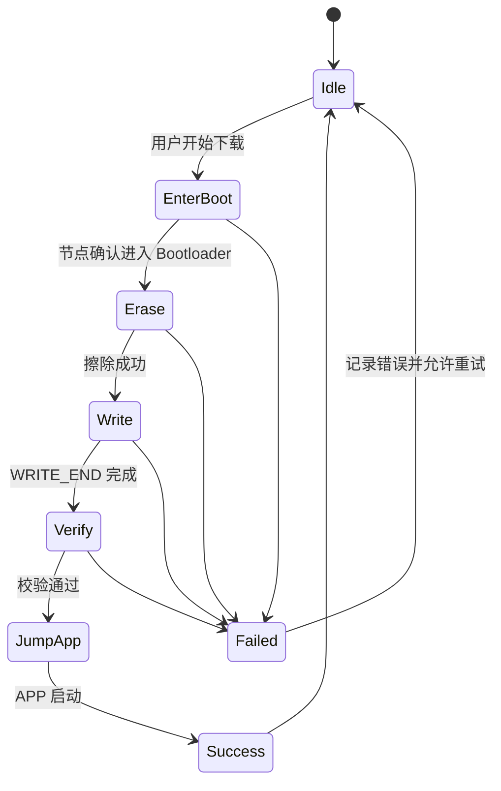

# 项目架构图

这份文档按三层阅读：先看系统总览，再看局部职责，最后看关键数据流细节。
每张图只回答一个问题，不用一张图塞下整个工程。

## 第一层：系统总览

问题：数据从哪里来，经过哪些边界，最后到达哪个页面？

| 结构 | 作用 | 不负责什么 |
| --- | --- | --- |
| 设备与总线 | 产生反馈、接受控制或升级命令 | 不参与 Qt 页面布局 |
| Transport | 把 USB CDC 字节可靠交给上层 | 不解释 CAN ID 或页面状态 |
| Protocol | 校验、拆包、编码协议对象 | 不持有 QWidget |
| Service / Data | 把协议对象变成快照、状态和升级进度 | 不绘制曲线 |
| MainWindow | 装配服务与页面、路由请求、控制高频数据入口 | 不重新拼协议字节 |
| UI | 显示快照、产生用户请求、管理曲线窗口 | 不直接访问串口或 CRC |

## 第二层：局部结构

### 2.1 通信与状态局部

问题：USB 收到一段字节后，谁处理普通电机反馈，谁处理升级？

| 结构 | 作用 |
| --- | --- |
| `SerialTransport` | 处理 USB CDC 的设备枚举、打开、关闭和字节流 |
| `BootloaderCommunicationService` | 统一发送 AA55、分发接收帧、维护心跳和传输错误 |
| `ObserverMotorProtocol` | 只做电机帧编码/解码和字段合法性检查 |
| `ObserverMotorDataService` | 聚合 Node1~8、维护有效性/过期状态，按 UI 频率发布 |
| `BootloaderService` | 把高级命令转换成 Bootloader 业务结果 |
| `BootloaderDownloadController` | 编排正式下载阶段和进度 |

### 2.2 UI 与曲线局部

问题：多个 Qwt 曲线窗口如何共享变量目录，却互不影响显示配置？

| 结构 | 作用 |
| --- | --- |
| `MotorDebugSnapshot` | 提供已解析的变量和采样时间，不关心画布 |
| `DebugSeries Catalog` | 为 UI 提供稳定变量 ID、显示名、单位、采样率和样本 |
| `MotorDebugPage` | 管理多窗口、IABC/速度预设、自定义窗口和二列布局 |
| `CurveWindow` | 保存本窗口的曲线选择和独立缩放状态 |
| `QwtCurvePlotWidget` | 负责多曲线、图例、缩放、平移和重绘，不决定协议 |

当前 Motor Debug 已使用 Qwt 显示多变量和多窗口。窗口布局持久化、
自定义颜色/左右 Y 轴以及高频原始样本环仍是后续边界。

## 第三层：关键数据流细节

### 3.1 `0x100` 电机控制

### 3.2 高频反馈到曲线

当前代码已经做到页面不可见时不把网关帧交给电机数据服务，Qwt 绘图后端也已接入；
但 ring buffer 和原始高频样本到曲线的链路仍待接入验证。关键约束是“采样频率”
和“绘图频率”分离：1000 Hz 的数据不能造成 1000 次 GUI repaint，也不能造成
1000 条日志。

### 3.3 Bootloader 下载

Bootloader 的收发和下载阶段日志保留；普通高频电机反馈不进入固件页日志。

## 阅读入口

- 协议字段和 CRC：`agent/ROV上位机通信协议与分层架构规范_v1.0.md`；
- 当前工具链和构建：`docs/toolchain.md`；
- 曲线组件选择和窗口设计：`docs/plotting.md`；
- Agent 开发边界：`agent/agent.md`。
