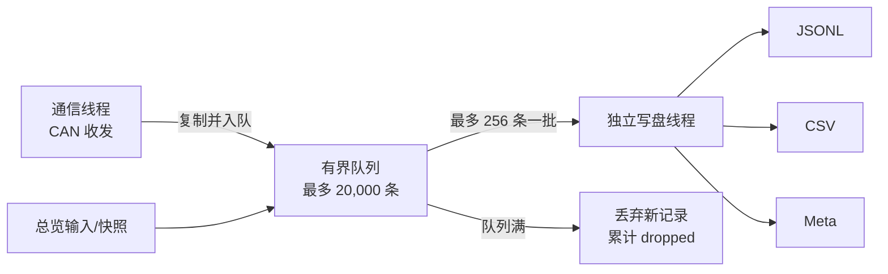

# 科研数据记录

总览页的“科研数据记录”卡片用于长期保存实验数据。它只显示会话状态、已接收数量和
丢弃数量，不显示逐点数据，也不会把记录样本送入曲线或固件日志。

## 使用方法

1. 在总览页点击“开始记录”，选择一个 `.jsonl` 文件名；
2. 正常连接设备并进行实验；记录器在所有页面持续工作，不依赖 Motor Debug 是否可见；
3. 实验结束后点击“停止”，等待状态恢复为“未记录”；
4. 点击“打开目录”，得到同名的 JSONL、CSV 和元数据文件。

正常退出主窗口也会先停止记录并排空队列。不要在实验中直接断电或强制结束进程；即使
JSONL 已写入的行通常仍可读取，最后的元数据文件也可能来不及生成。

## 输出文件

假设用户选择 `ROV_科研记录_20260921_120000.jsonl`，同一目录会生成：

| 文件 | 用途 |
| --- | --- |
| `*.jsonl` | 主记录；每行一个独立 JSON 对象，保留完整字段和原始 CAN 数据 |
| `*.csv` | 固定列导出；便于 MATLAB、Python、Origin、Excel 等分析 |
| `*.meta.json` | 会话起止时间、接收/写入/丢弃计数、队列容量和时间戳策略 |

JSONL 和 CSV 在采集过程中同时追加写入，因此“导出”不需要再从 UI 扫描或复制高频内存
数据。CSV 中不存在或尚未接入的值保持空白，JSON 中使用缺失字段或 `null`，绝不以零
伪装为有效传感器值。

## 已记录内容

### CAN 原始帧

- 收发方向：`rx` / `tx`；
- 网关序号、CAN ID、FLAGS 和完整十六进制 payload；
- UTC 时间和会话单调微秒时间。

未知 CAN ID 也会保存原始帧。这使得后续新增传感器解码器后，仍可离线重放和重新解释
旧实验数据。

### Observer Motor

在原始帧之外，记录器会调用同一套 `ObserverMotorProtocol` 解码，并附加：

- 普通反馈：节点、转速、`Iq`、母线电压、温度、状态、反馈序号；
- 调试反馈：`Iu/Iv/Iw`、`Id/Iq`、`Ud/Uq`、PLL 电速度、观测器角度和状态标志；
- 控制帧：命令、节点掩码、运行掩码以及 Node1~Node8 的目标转速。

### 输入、深度与姿态

- 总览六自由度输入：surge、sway、heave、roll、pitch、yaw；
- 解锁、停机、保持位置、上浮等用户事件；
- 非演示 `DashboardSnapshot` 中的深度、横滚、俯仰、航向、母线电压、内部温度、
  报警数和推进器快照。

当前工程尚没有真实 IMU、压力/深度传感器协议和数据服务。记录格式已经预留
`imu_accel_*`、`imu_gyro_*`、`pressure_pa` 等列；在真实协议接入前这些列为空，演示页的
12.4 m 等预览数据不会写入科研记录。传感器原始 CAN 帧仍会完整保存，后续应在
Protocol / Service 层增加解码并把非演示快照交给记录器。

## 性能与完整性策略

- 通信线程不执行 JSON/CSV 格式化和磁盘 I/O；
- 后台线程每批最多处理 256 条，文件刷新和 UI 状态最多约每 250 ms 一次；
- 队列满时不阻塞 CAN 接收，而是丢弃新记录并增加 `dropped_records`；
- 每条记录同时带 UTC 和从会话开始计算的单调微秒时间，分析采样间隔应优先使用
  `monotonic_us`；跨设备对时仍需外部同步方案；
- 科研归档时必须同时保存三个同名文件，并检查 `dropped_records == 0`。

## 实现入口

- `src/data/recording/ResearchDataRecorder.*`：有界队列、后台序列化、文件生命周期；
- `src/app/MainWindow.cpp`：在页面可见性判断之前旁路记录原始帧，并连接总览请求；
- `src/pages/dashboard/DashboardPage.*`：只提供开始/停止/打开目录和低频状态显示；
- `tests/ResearchDataRecorderTest.cpp`：验证电机、输入、深度、预留 IMU 列和元数据。

